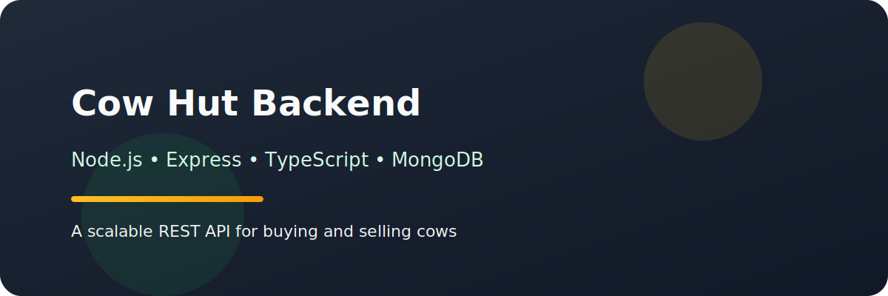

# Cow Hut Backend 🐄🏠



A robust and scalable marketplace REST API for buying and selling cows, designed with **Node.js**, **Express**, **TypeScript**, and **MongoDB**. This project provides a comprehensive solution for managing users (buyers and sellers), cow listings, and an order processing system with financial transaction handling.

---

## 🌟 Key Features

### 👤 User Management
- **Role-based access**: Support for `buyer` and `seller` roles.
- **Profile Management**: CRUD operations for users.
- **Financial Tracking**: Automated budget management for buyers and income tracking for sellers.

### 🐄 Cow Management
- **Listing & Discovery**: Full CRUD for cow listings with detailed attributes (breed, category, weight, etc.).
- **Advanced Filtering**: Filter by location, price range, and search terms.
- **Pagination & Sorting**: Efficient data retrieval for large datasets.

### 🛒 Order & Transactions
- **Secure Purchasing**: Atomicity ensured via MongoDB Transactions.
- **Budget Validation**: Prevents purchases beyond buyer's budget.
- **Status Updates**: Automated "sold out" status updates upon successful transaction.

### 🛠 Technical Excellence
- **Validation**: Strict schema validation using Zod.
- **Error Handling**: Centralized global error handling with consistent API responses.
- **Logging**: System activities and errors tracked via Winston logger.

---

## 🚀 Tech Stack

- **Runtime**: Node.js
- **Framework**: Express.js
- **Language**: TypeScript
- **Database**: MongoDB (Mongoose ODM)
- **Validation**: Zod
- **Logger**: Winston
- **Developer Tools**: ESlint, Prettier, ts-node-dev

---

## 📂 Project Structure

```text
src/
├── app.ts            # Application entry & middleware
├── server.ts         # Server listener & DB connection
├── config/           # Environment and global configs
├── modules/          # Feature-based business logic
│   ├── auth/         # Authentication flow
│   ├── users/        # User management
│   ├── cows/         # Cow listings & catalog
│   └── order/        # Transaction & orders
├── middlewares/      # Global & auth middlewares
├── errors/           # Custom error classes
└── shared/           # Reusable utilities & shared logic
```

---

## 🔨 Getting Started

### Prerequisites
- Node.js (v18+)
- MongoDB Atlas or Local MongoDB instance
- npm or yarn

### Installation

1. **Clone the repository**:
   ```bash
   git clone <repository-url>
   cd cow-hut-backend
   ```

2. **Install dependencies**:
   ```bash
   npm install
   ```

3. **Configure Environment Variables**:
   Create a `.env` file in the root directory and add the following:
   ```env
   NODE_ENV=development
   PORT=5000
   DATABASE_URL=your_mongodb_uri
   ```

4. **Run the application**:
   ```bash
   # Development mode
   npm run dev

   # Production build
   npm run build
   npm start
   ```

---

## 🔗 Main API Endpoints

| Method | Endpoint | Description |
| :--- | :--- | :--- |
| **POST** | `/api/v1/auth/signup` | Register a new user |
| **GET** | `/api/v1/users` | Retrieve all users |
| **GET** | `/api/v1/cows` | Filterable list of cows |
| **POST** | `/api/v1/cows` | Add a new cow |
| **POST** | `/api/v1/orders` | Purchase a cow |

---

## 📜 Scripts

| Script | Command | Description |
| :--- | :--- | :--- |
| `dev` | `npm run dev` | Runs the server in watch mode |
| `build` | `npm run build` | Compiles TypeScript to JavaScript |
| `lint` | `npm run lint` | Checks code for linting errors |
| `format` | `npm run format` | Formats code using Prettier |

---

## 🤝 Contributing

Contributions are welcome! Please feel free to submit a Pull Request.

---

## 📄 License

This project is licensed under the **ISC License**.
